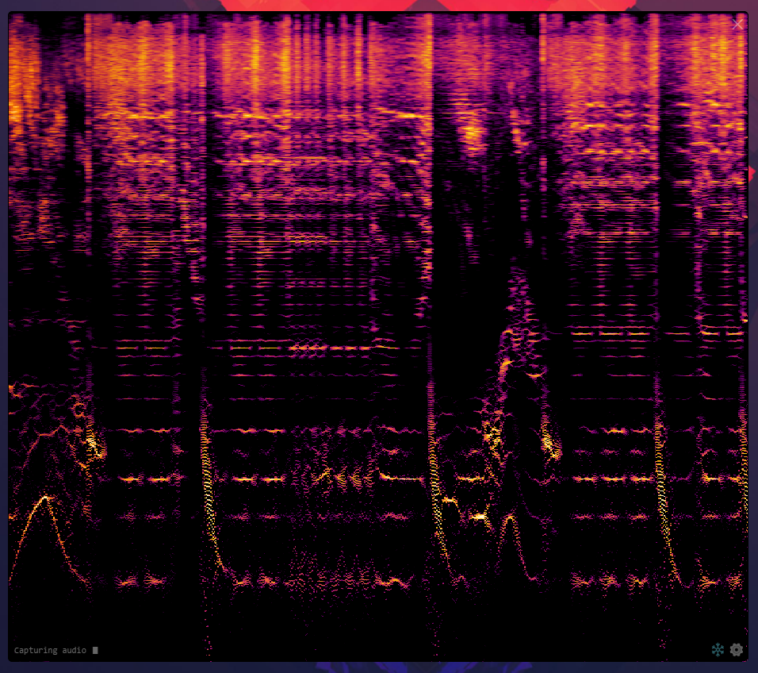
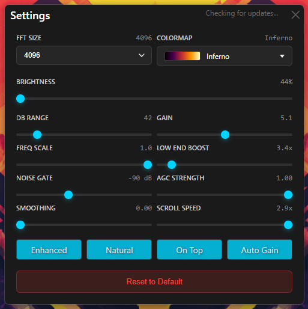

# EM-Spec

Real-time audio spectrogram visualizer with enhanced low-end and reassignment method implementation.

 

## Features

- **Real-time Spectrogram Visualization** - See your audio in stunning detail
- **Enhanced Low-End Response** - Optimized for music production and mixing
- **Reassignment Method** - Advanced frequency analysis for sharper spectral detail
- **Customizable Settings** - Adjust FFT size, color maps, gain, and more
- **Always-On-Top Mode** - Keep the spectrogram visible while you work
- **Automatic Gain Control** - Adaptive brightness for consistent visualization
- **Multiple Color Maps** - Choose from various color schemes

## Download

Download the latest version from the [Releases](https://github.com/effree/EM-Spec/releases) page.

### Windows
Download `EM-Spec-Setup-[version].exe` and run the installer.

### macOS
Download `EM-Spec-[version]-[arch].dmg`, open it, and drag EM-Spec to your Applications folder.

## System Requirements

- **Windows**: Windows 10 or later (64-bit)
- **macOS**: macOS 10.13 or later (Intel and Apple Silicon)

## Usage

1. Launch EM-Spec
2. The spectrogram will automatically start visualizing your system audio
3. Click to drag
4. Hover bottom right to access settings button
5. Hold Shift and hover over the spectrogram to see note and frequency information

## Settings

- **FFT Size**: Frequency resolution (higher = more detail, more CPU)
- **Scroll Speed**: How fast the spectrogram scrolls
- **Color Map**: Visual style of the spectrogram
- **dB Range**: Dynamic range of the display
- **Gain**: Overall brightness
- **Frequency Scale**: Zoom in/out on the frequency axis
- **Low-End Boost**: Emphasize bass frequencies
- **Smoothing**: Temporal smoothing for cleaner display
- **Noise Gate**: Hide signals below this threshold

## Auto-Updates

EM-Spec automatically checks for updates on startup. When an update is available, you'll be notified in the settings window.

## Ableton Live Integration

EM-Spec includes a Max for Live device that automatically shows/hides the spectrogram window based on Ableton's Info View visibility.

**[Learn more about the Max for Live integration →](docs/MAX-FOR-LIVE.md)**

## Support

For bug reports and feature requests, please use the [GitHub Issues](https://github.com/effree/EM-Spec/issues) page.

## License

Copyright © 2025 Jeffrey Meyer

---

**Note**: This is a distribution repository for EM-Spec releases. The source code is maintained in a private repository.